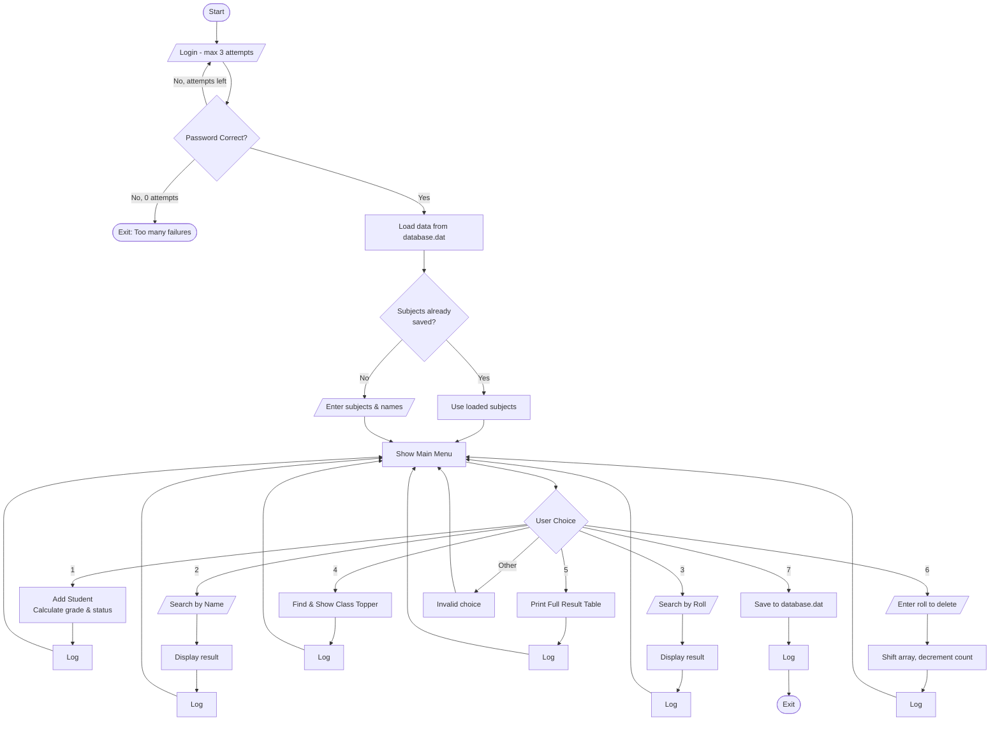

# Student GradeBook System

A robust and efficient C-based Student Grade Management System designed to handle student records, calculate academic results, and maintain persistent logs of system activities.

## 🚀 Features

- **Secure Login**: Protected by administrative password authentication (max 3 attempts).
- **Student Management**: Add, calculate, and manage student grades across multiple subjects.
- **Student Deletion**: Securely remove student records with automatic data shifting.
- **Dual Search Functionality**: Search student records by Name or Roll Number.
- **Performance Analytics**: Instantly identify the class topper.
- **Persistent Storage**: Data is loaded on startup and saved on exit. Subject configuration is preserved between sessions.
- **Activity Logging**: Detailed tracking of system usage and administrative actions in `activity_log.dat`.

## 🎓 Grading Strategy

| Percentage Range | Grade | Status |
| :--- | :---: | :--- |
| 80% and Above | **A** | PASS |
| 65% - 79% | **B** | PASS |
| 50% - 64% | **C** | PASS |
| 40% - 49% | **D** | PASS |
| Below 40% | **F** | FAIL |

## 📊 System Flowchart



## 🛠️ Technology Stack

- **Language**: C
- **Compiler**: GCC / Any standard C compiler
- **Storage**: Binary flat-file (`database.dat`) for records, text file (`activity_log.dat`) for logs

## 📖 How to Run

1. **Compile the Project**:
    ```bash
    gcc main.c student.c auth.c delete.c -o GradeBook
    ```
2. **Execute**:
    ```bash
    ./GradeBook
    ```
3. **Default Credentials**:
    - **Password**: `admin123`

## 📂 Project Structure

| File | Description |
| :--- | :--- |
| `main.c` | Entry point — menu loop and program flow |
| `student.c / student.h` | Core logic: add, search, save, load, grade calculation |
| `delete.c / delete.h` | Modular student record deletion logic |
| `auth.c / auth.h` | Password authentication layer |
| `database.dat` | Binary data file (auto-generated at runtime) |
| `activity_log.dat` | Activity log file (auto-generated at runtime) |

---
*Developed as part of the AAATest Student Management Suite.*
