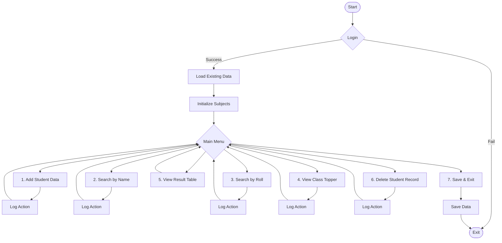

# Student GradeBook System

A robust and efficient C-based Student Grade Management System designed to handle student records, calculate academic results, and maintain persistent logs of system activities.

## 🚀 Features

- **Secure Login**: Protected by administrative password authentication.
- **Student Management**: Add, calculate, and manage student grades across multiple subjects.
- **Student Deletion**: Securely remove student records with automatic data shifting.
- **Dual Search Functionality**: Search student records by Name or Roll Number.
- **Performance Analytics**: Instantly identify the class topper.
- **Persistent Storage**: Automatic data loading and saving to ensure data integrity between sessions.
- **Activity Logging**: Detailed tracking of system usage and administrative actions.

## 🎓 Grading Strategy

The system automatically calculates academic grades based on the percentage of marks achieved:

| Percentage Range | Grade | Status |
| :--- | :---: | :--- |
| 80% and Above | **A** | PASS |
| 65% - 79% | **B** | PASS |
| 50% - 64% | **C** | PASS |
| 40% - 49% | **D** | PASS |
| Below 40% | **F** | FAIL |

## 📊 System Flowchart



## 🛠️ Technology Stack

- **Language**: C
- **Compiler**: GCC / Any standard C compiler
- **Storage**: Flat-file database for records and logs

## 📖 How to Run

1.  **Compile the Project**:
    ```bash
    gcc main.c -o GradeBook
    ```
2.  **Execute**:
    ```bash
    ./GradeBook
    ```
3.  **Default Credentials**:
    - **Password**: `admin123`

## 📂 Project Structure

- `main.c`: Core application logic and menu system.
- `student.c / student.h`: Student record management and calculations.
- `delete.c / delete.h`: Modular student record deletion logic.
- `auth.c / auth.h`: Authentication and security layer.
- `activity_log.dat`: Automated log of system interactions.

---
*Developed as part of the AAATest Student Management Suite.*
